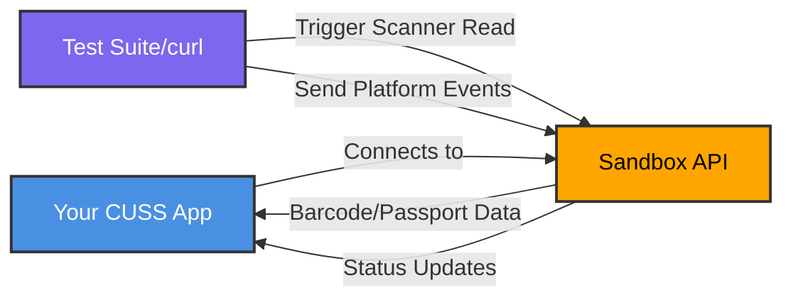

# CUSS2 Sandbox API – README

## Testing Flow Overview



This guide shows how to launch a CUSS2 web application against the **sandbox**, emulate **platform status/events**, and simulate **scanner reads** (barcode, MRZ, ePassport DGs). It's written for quick copy-paste testing with `curl` and browser launch URLs.

> **Before you begin:** Visit your team’s **Sandbox UI** to create a unique `client_id` and `client_secret` for your app/test user. Store them securely and never commit them to source control.

---

## At a Glance

- **API docs (Swagger UI):** https://cloudsandbox.azurewebsites.net/docs
- **Sandbox base URL (REST):** `https://cloudsandbox.azurewebsites.net`
- **OAuth token endpoint:** `https://cloudsandbox.azurewebsites.net/oauth/token`
- **WebSocket (WSS) endpoint:** `wss://cloudsandbox.azurewebsites.net`
- **Credentials:** `client_id=<your-client-id>` · `client_secret=<your-client-secret>` (create them in the Sandbox UI before testing).
- **Device ID:** any GUID (example: `550e8400-e29b-41d4-a716-446655440000`)

> ⚠️ Security note: never commit real credentials to source control. Use environment variables or a secret manager, and rotate regularly.

---

## 1) Quick Start – Launch your CUSS app in the browser

Pass the sandbox endpoints as query parameters to your CUSS web app. Example (demo app URL shown for illustration):

```

[https://kapapp.herokuapp.com/?CUSS-WSS=wss:%2F%2Fcloudsandbox.azurewebsites.net\&OAUTH-URL=https:%2F%2Fcloudsandbox.azurewebsites.net%2Foauth%2Ftoken\&client-id=](https://kapapp.herokuapp.com/?CUSS-WSS=wss:%2F%2Fcloudsandbox.azurewebsites.net&OAUTH-URL=https:%2F%2Fcloudsandbox.azurewebsites.net%2Foauth%2Ftoken&client-id=)<your-client-id>\&client-secret=<your-client-secret>

````

**Required launch inputs**

- **Vendor:** `EAI` (example)
- **Device-ID:** any GUID
- **OAuth URL:** `https://cloudsandbox.azurewebsites.net/oauth/token`
- **CUSS WSS:** `wss://cloudsandbox.azurewebsites.net`

---

## 2) Auth model (simple)

Most REST requests accept a JSON body that includes your **`client_secret`**. Keep it in your server-side code or a secure secret store—avoid exposing it client-side in production.

---

## 3) Endpoints you’ll use most

### 3.1 Activate the app (optional)
```bash
curl -X POST https://cloudsandbox.azurewebsites.net/app/activate \
  -H "Content-Type: application/json" \
  -d '{
    "client_secret": "<your-client-secret>",
    "brand": "airline-brand",
    "accessible": true
  }'
````

Enables branded/accessibility settings in the sandbox.

### 3.2 Get CUSS contexts

```bash
curl -X POST https://cloudsandbox.azurewebsites.net/app/context \
  -H "Content-Type: application/json" \
  -d '{"client_secret":"<your-client-secret>"}'
```

Returns the current and available contexts.

### 3.3 List components (find your scanner ID)

```bash
curl -X POST https://cloudsandbox.azurewebsites.net/app/components \
  -H "Content-Type: application/json" \
  -d '{"client_secret":"<your-client-secret>"}'
```

Response includes an array with each `componentID` and a description. Note the **scanner** component’s ID for use below.

---

## 4) Emulate platform **status/events**

Post a **message code** to a specific component:

```bash
curl -X PATCH https://cloudsandbox.azurewebsites.net/app/components/<component_id> \
  -H "Content-Type: application/json" \
  -d '{
    "client_secret":"<your-client-secret>",
    "message_code":"MEDIA_ABSENT"
  }'
```

**Notes**

* Endpoint: `/app/components/{component_id}` (PATCH)
* Required fields: `client_secret`, `message_code`
* Example message codes: `OK`, `DATA_PRESENT`, `MEDIA_ABSENT`, `TIMEOUT`, …

---

## 5) Simulate **scanner reads** (barcode / MRZ / ePassport)

Send a **payload** to the scanner component containing one or more **dataRecords**:

```bash
curl -X PATCH https://cloudsandbox.azurewebsites.net/app/components/<component_id>/payload \
  -H "Content-Type: application/json" \
  -d '{
    "client_secret":"<your-client-secret>",
    "dataRecords":[
      {
        "dsTypes":["DS_TYPES_BARCODE"],
        "data":"ABC123456789",
        "dataStatus":"DS_OK",
        "encoding":"TEXT"
      }
    ]
  }'
```

**Schema pointers**

* `dataRecords[]` items follow a **DataRecord** shape: `dsTypes[]`, `dataStatus`, `data`, `encoding`
* `dataStatus`: `DS_OK`, `DS_CORRUPTED`, `DS_INCOMPLETE`, …
* `encoding`: `TEXT` or `BASE64` (use `BASE64` for binary DGs)

### 5.1 Barcode examples

**QR (TEXT)**

```json
{
  "client_secret": "<your-client-secret>",
  "dataRecords": [
    { "dsTypes": ["DS_TYPES_SCAN_QR"], "data": "WIFI:S:MySSID;T:WPA;P:secret;;", "dataStatus": "DS_OK", "encoding": "TEXT" }
  ]
}
```

**Code128 (TEXT)**

```json
{
  "client_secret": "<your-client-secret>",
  "dataRecords": [
    { "dsTypes": ["DS_TYPES_SCAN_CODE128"], "data": "M1SMITH/JOHN   E123456", "dataStatus": "DS_OK", "encoding": "TEXT" }
  ]
}
```

Other barcodes are similar, e.g. `DS_TYPES_SCAN_CODE39`, generic `DS_TYPES_BARCODE`.

### 5.2 Passport / ePassport examples

**MRZ (codeline as TEXT)**

```json
{
  "client_secret": "<your-client-secret>",
  "dataRecords": [
    { "dsTypes": ["DS_TYPES_CODELINE"], "data": "P<USASMITH<<JOHN<<<<<<<<<<<<<<<<<<<<<<<1234567890USA8001019M2501012<<<<<<<<<<<<<<08", "dataStatus": "DS_OK", "encoding": "TEXT" }
  ]
}
```

**ePassport DG1 (BASE64)**

```json
{
  "client_secret": "<your-client-secret>",
  "dataRecords": [
    { "dsTypes": ["DS_TYPES_EPASSPORT_DG1"], "data": "<BASE64-DG1-BINARY>", "dataStatus": "DS_OK", "encoding": "BASE64" }
  ]
}
```

> Tip: After posting a payload, you can optionally send a follow-up event (e.g. `message_code: "DATA_PRESENT"`) to notify your app that new data is available.

---

## 6) Common test flows

**A. QR scan then “no media”**

1. `PATCH /app/components/{scannerId}/payload` with `DS_TYPES_SCAN_QR` (see 5.1).
2. `PATCH /app/components/{scannerId}` with `{"message_code":"DATA_PRESENT"}`.
3. Later, clear with `{"message_code":"MEDIA_ABSENT"}`.

**B. MRZ -> DG1 handoff**

1. Send MRZ via `DS_TYPES_CODELINE` (TEXT).
2. If your app expects an ePassport read, send DG1 as BASE64 via `DS_TYPES_EPASSPORT_DG1`.
3. Raise `DATA_PRESENT` to trigger downstream processing.

---

## 7) Troubleshooting checklist

* **400 Bad Request** → usually missing fields or an invalid `message_code`/payload shape.
* Double-check you’re targeting the **right `component_id`** from `/app/components`.
* Include **`client_secret`** in every call that requires it.
* For binary data groups (e.g., ePassport DGs), use `encoding: "BASE64"` and provide valid base64 content.

---

## 8) FAQ

**Can I choose any Device ID?**
Yes—use any GUID for sandbox testing.

**Do I need OAuth headers?**
In this simplified sandbox flow, requests accept the `client_secret` inside the body. Production patterns may differ.

**Where do I find message codes and dsTypes?**
Use the examples above and your app’s expectations. The sandbox supports common codes like `DATA_PRESENT`, `MEDIA_ABSENT`, and dsTypes such as `DS_TYPES_SCAN_QR`, `DS_TYPES_CODELINE`, `DS_TYPES_EPASSPORT_DG1`, etc.

---

## 9) Appendix – Copy-paste snippets

**List components**

```bash
curl -X POST https://cloudsandbox.azurewebsites.net/app/components \
  -H "Content-Type: application/json" \
  -d '{"client_secret":"<your-client-secret>"}'
```

**Post event**

```bash
curl -X PATCH https://cloudsandbox.azurewebsites.net/app/components/<component_id> \
  -H "Content-Type: application/json" \
  -d '{"client_secret":"<your-client-secret>","message_code":"OK"}'
```

**Post payload (QR)**

```bash
curl -X PATCH https://cloudsandbox.azurewebsites.net/app/components/<component_id>/payload \
  -H "Content-Type: application/json" \
  -d '{"client_secret":"<your-client-secret>","dataRecords":[{"dsTypes":["DS_TYPES_SCAN_QR"],"data":"HELLO","dataStatus":"DS_OK","encoding":"TEXT"}]}'
```

---

Happy testing!

---

## 10) API Reference (Swagger UI)

For an interactive reference of all endpoints, request/response schemas, and live testing, visit the Swagger UI:

**[https://cloudsandbox.azurewebsites.net/docs](https://cloudsandbox.azurewebsites.net/docs)**
